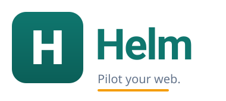

<div align="center">



<h1>Helm</h1>

<h3>让 AI 在你真实浏览器里自主操作——点击、输入、下载，无需重登，不被识别为机器</h3>

[](https://github.com/zhangjianchun1122/helm)
[](https://developer.chrome.com/docs/extensions/mv3/intro/)
[](https://modelcontextprotocol.io)
[](LICENSE)
[](https://nodejs.org)

</div>

---

## 这是什么

Helm 是一个**通用浏览器操作工具**。你用自然语言下达指令，AI Agent 自主规划操作序列，Helm 在你**日常使用的、已登录的浏览器**里按序执行——复用你的 Cookie/会话，隐蔽性最好，不被反爬检测识别。

它**不针对任何特定网站**。Agent 根据实时页面快照动态决策，PMS 文档下载、Wikipedia 信息抓取、任何站点的表单提交……都是同一个工具集的不同组合。

```
你："用账号 A 登录 xx.com，下载最新报表"
  → Agent 规划：navigate → fill(账号) → fill(密码) → click(登录)
               → wait → get_snapshot → click(报表) → download
  → Helm 逐步执行，Side Panel 实时展示动作流
```

## 为什么用 Helm

| 对比 | Helm（Chrome 扩展） | Playwright/Puppeteer | 手动操作 |
|---|---|---|---|
| 复用已登录会话 | ✅ 日常浏览器自带 | ❌ 每次重登 | ✅ |
| 自动化检测 | ✅ 真实 profile，最隐蔽 | ❌ webdriver 痕迹明显 | — |
| 跨 iframe 操作 | ✅ all_frames 注入 | ✅ | 手动 |
| Agent 接入 | ✅ MCP 标准 | 需自封装 | — |
| 任意路径下载 | ✅ 网关 fetch + 扩展兜底 | ✅ | 手动 |
| 安装成本 | 中（扩展 + 网关） | 低 | — |

## 架构

```
Agent（ZCode / Claude Code / Qwen / Hermes / Codex）
  │  MCP stdio（JSON-RPC）
  ▼
mcp-server.mjs ──invoke──▶ bridge.mjs（WS :8787，常驻后台）
                                │  WebSocket
                                ▼
                     Chrome 扩展（MV3）
                      ├─ offscreen.js    长连接保活
                      ├─ sw.js           路由调度 + chrome.debugger
                      ├─ dom-agent.js    DOM 探查与操作（all_frames）
                      └─ sidepanel.js    连接状态 + 动作流 UI
                                │
                                ▼
                     用户真实浏览器页面
```

**关键设计**：MV3 Service Worker 约 30s 被回收，长连接和状态放在 Offscreen Document 与网关进程里，SW 保持无状态可随时重建。多个 Agent 同时使用时，各自 spawn 的 mcp-server 走附属模式连同一个常驻 bridge，互不干扰。

## 25 个工具

Helm 提供 21 个浏览器/文件操作工具和 4 个权限管理工具。

### 感知类
| 工具 | 作用 |
|---|---|
| `get_snapshot` | 返回页面可交互元素快照（ref/tag/text/attrs），Agent 用 ref 引用元素，不写 CSS 选择器 |
| `list_tabs` | 列出 Chrome 所有标签页 |
| `list_frames` | 枚举当前页所有 iframe（跨 iframe 操作基础） |
| `get_text` | 读取元素纯文本 |

### 操作类
| 工具 | 作用 |
|---|---|
| `navigate` | 打开 URL，等待加载完成 |
| `click` / `right_click` | 左键点击 / 真实右键（chrome.debugger isTrusted） |
| `fill` | 输入文本 |
| `press` | 键盘事件（Enter / Esc / 快捷键） |
| `scroll` | 滚动到元素 / 方向滚动 |
| `hover` | 悬停（触发菜单 / tooltip） |
| `drag` | 拖拽（双协议：鼠标序列 + HTML5 DnD） |

### 流程控制类
| 工具 | 作用 |
|---|---|
| `wait` | 等待文本出现/消失、选择器匹配、DOM 静止（SW 轮询，超时返回 false 不抛错） |
| `set_active_frame` / `get_active_frame` | 切换 iframe 作用域 |
| `eval` | 执行任意 JS（MAIN world 注入，绕过扩展 CSP，所有站点可用） |
| `screenshot` | 截图（base64 PNG/JPEG） |

### 产物类
| 工具 | 作用 |
|---|---|
| `download` | 下载文件（三级 fallback：网关 fetch → 扩展 chrome.downloads → 搬运） |
| `save_file` / `read_file` / `list_files` | 本地文件读写（网关 Node fs 直写） |

### 权限管理类
| 工具 | 作用 |
|---|---|
| `allow_once` | 单次授权高危工具，执行后自动撤销 |
| `set_permission` | 按会话级、项目级或用户级持久授权 |
| `get_permissions` | 查看 `eval` / `download` / `save_file` 的授权状态 |
| `revoke_permission` | 撤销指定层级或全部层级的授权 |

## 快速开始

> **注意**：Chrome MV3 不允许命令行自动加载扩展到已有 profile，安装完成后需手动加载一次扩展（约 10 秒），详见下方步骤 4。

### 方式一：一键安装（推荐）

1. 下载 [Helm-Portable-0.1.0.zip](../../releases)
2. 解压到任意目录
3. 双击 `install/install.bat`
4. **手动加载 Chrome 扩展**（安装器会自动打开 `chrome://extensions` 页面）：
   - 确认右上角「开发者模式」已开启
   - 点击「加载已解压的扩展程序」
   - 选择解压目录下的 `extension` 文件夹

安装器自动完成：检测环境 → 安装依赖 → 注册开机自启 → 启动网关 → 打开 Chrome 扩展页 → 验证连通。安装完成后会打印各 Agent 的 MCP 配置片段，复制即可使用。

### 方式二：从源码安装

```bash
git clone https://github.com/zhangjianchun1122/helm.git
cd helm
cd gateway && npm install
```

然后双击 `install/install.bat`，或手动启动网关：

```bash
node gateway/bridge-daemon.mjs
```

同样需按上方**步骤 4** 在 Chrome 中手动加载 `extension/` 目录。

### 接入 Agent

Helm 通过 MCP stdio 暴露工具，任何支持 MCP 的 Agent 直接配置即可：

<details>
<summary><b>ZCode</b> — <code>~/.zcode/cli/config.json</code></summary>

```json
{
  "mcp": {
    "servers": {
      "helm": {
        "type": "stdio",
        "command": "node",
        "args": ["/path/to/helm/gateway/mcp-server.mjs"]
      }
    }
  }
}
```
</details>

<details>
<summary><b>Claude Code</b> — <code>.mcp.json</code></summary>

```json
{
  "mcpServers": {
    "helm": {
      "type": "stdio",
      "command": "node",
      "args": ["/path/to/helm/gateway/mcp-server.mjs"]
    }
  }
}
```
</details>

<details>
<summary><b>Qwen CLI</b> — <code>~/.qwen/settings.json</code></summary>

```json
{
  "mcpServers": {
    "helm": {
      "command": "node",
      "args": ["/path/to/helm/gateway/mcp-server.mjs"]
    }
  }
}
```
</details>

<details>
<summary><b>Hermes Agent</b> — <code>%LOCALAPPDATA%/hermes/config.yaml</code></summary>

```yaml
mcp_servers:
  helm:
    command: "node"
    args: ["/path/to/helm/gateway/mcp-server.mjs"]
```
</details>

<details>
<summary><b>Codex CLI</b> — <code>~/.codex/config.toml</code></summary>

```toml
[mcp_servers.helm]
command = "node"
args = ["/path/to/helm/gateway/mcp-server.mjs"]
```
> Codex 有内置浏览器工具，在 Codex 中建议使用其自带工具。
</details>

<details>
<summary><b>非 MCP 智能体 / 自研 Agent（HTTP 接入）</summary>

```bash
# 启动 HTTP 端点
HELM_API_KEY=mykey node gateway/http-server.mjs --port 8788

# 获取工具清单
curl -H "Authorization: Bearer mykey" http://127.0.0.1:8788/v1/tools

# 调用工具
curl -X POST -H "Authorization: Bearer mykey" -H "Content-Type: application/json" \
  -d '{"name":"list_tabs","arguments":{}}' \
  http://127.0.0.1:8788/v1/tools/call
```
</details>

## 安全设计

Helm 在用户真实浏览器里操作，安全是核心关切。三层防护：

| 层 | 机制 | 说明 |
|---|---|---|
| **普通工具** | 会话内直接执行 | 页面感知、点击、输入等工具根据 Agent 任务自主执行 |
| **高危工具授权** | `eval` / `download` / 覆盖式 `save_file` 默认拦截 | 用户可选择单次、会话级、项目级或用户级授权，并可随时撤销；`save_file` 追加模式不视为高危 |
| **审计日志** | 所有高危操作记录 | `gateway/audit-log.txt`，JSON 格式，含时间/工具/参数/结果 |

加上 Side Panel 动作流可视化 + 页面琥珀发光边框，用户随时知道 Agent 在干什么，可随时介入。HTTP 端点除 `/health` 外均需 Bearer Token 鉴权；未显式配置 `HELM_API_KEY` 时会随机生成 token。

## 项目结构

```
helm/
├─ extension/              # Chrome 扩展（MV3，站点无关）
│  ├─ manifest.json
│  ├─ sw.js                # Service Worker：路由调度 + chrome.debugger
│  ├─ offscreen.js         # Offscreen Document：WebSocket 长连接保活
│  ├─ sidepanel.js         # 连接状态 + 动作流 UI
│  └─ content/dom-agent.js # DOM 探查与操作（注入各 frame）
├─ gateway/                # 本地网关
│  ├─ mcp-server.mjs       # MCP Server（stdio，主接入协议）
│  ├─ http-server.mjs      # HTTP 端点（非 MCP Agent 兜底）
│  ├─ bridge.mjs           # WebSocket 桥（主/附属模式自动切换）
│  ├─ bridge-daemon.mjs    # 常驻启动器（开机自启用）
│  ├─ tools-def.mjs        # 25 个工具定义 + 映射（共享模块）
│  ├─ permissions.mjs      # 高危工具的分层授权与撤销
│  └─ start-gateway.bat    # 启动包装器
├─ install/                # 一键安装/卸载器
│  ├─ install.bat / install.ps1
│  ├─ uninstall.bat / uninstall.ps1
│  └─ README.md
├─ scripts/
│  └─ build-pack.ps1       # 打包脚本（生成可分发 ZIP）
└─ docs/                   # 设计文档
```

## 系统要求

- **Windows** 10 / 11
- **Node.js** 18+
- **Google Chrome**

不需要管理员权限。

## 开发

```bash
# 运行 e2e 测试（需扩展已连接）
cd gateway && node verify-e2e.mjs

# 打包分发 ZIP
powershell -File scripts/build-pack.ps1 -Version 0.1.0
```

## 已验证的 Agent

| Agent | 协议 | 状态 |
|---|---|---|
| ZCode | MCP stdio | ✅ 已验证 |
| Qwen CLI | MCP stdio | ✅ 已验证 |
| Hermes Agent | MCP stdio | ✅ 已验证 |
| Claude Code | MCP stdio | ✅ 已验证 |
| Codex CLI | MCP stdio | ✅ 已验证 |

## License

MIT
